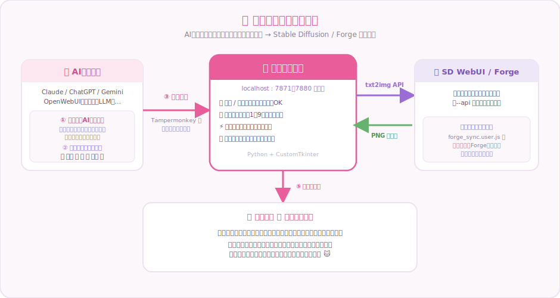

<div align="center">

# 🎀 ぷろんぷたん

**AIチャットの "情景" を、そのまま絵に。**

AIの返事からプロンプトを自動でキャッチして、Stable Diffusion / Forge で即生成するブリッジツール


**日本語** ｜ [English](README_EN.md)

[📖 マニュアル（日本語）](MANUAL_JA.md) ｜ [📖 Manual (English)](MANUAL_EN.md)

</div>

---

## ✨ ぷろんぷたんとは

AIとおしゃべりしていると「いまの場面、絵で見たい！」って瞬間があるよね。
**ぷろんぷたん**は、AIがマーカー付きで出力した画像生成プロンプトをブラウザから自動でキャッチして、
ローカルの Stable Diffusion WebUI / Forge にそのまま流し込むツールだよ。

チャットを続けているだけで、横のウィンドウに絵が届く。それがぷろんぷたん。🐱

<div align="center">

</div>

## 🖥 画面

受信したプロンプト・生成された絵・履歴カルーセルがひと目で見渡せるよ。

<div align="center">

</div>

## 🖼 サンプルギャラリー

ぷろんぷたん経由で生成した絵だよ（モデル：NoobAI系）。

| | | |
|:---:|:---:|:---:|
|  |  |  |
| ひまわり畑と麦わら帽子 | 秋のレッサーパンダ | 桜の枝の小鳥 |
|  |  |  |
| 窓辺でまどろむ猫 | 窓辺の白ねこ | ひまわりと柴犬 |

## 🆕 What's New!

- **2026/06/11**
  - ✍️ **手動入力での生成**に対応！欄に直接書いても、受信したプロンプトを「ちょい直し」してもOK
  - 💡 ランプ全面刷新：ピルが `待機中 → 受信完了 → 生成済み` と進む・生成中チップはふわふわ明滅・ミニランプは受信でペカーっと点滅
  - 🪄 **Forgeプロンプト自動入力**（forge_sync v1.3）：受信したプロンプトがForgeのUIにも自動で入る
- **2026/06/10**
  - 📌 ミニモード刷新：ポラロイド風の常時最前面ウィンドウに。位置とサイズも記憶
- **2026/06/09**
  - 🎀 UIフルリデザイン：Lucideアイコン・履歴カルーセル・上品カワイイ配色

## 🌟 主な機能

| 機能 | 説明 |
|---|---|
| 📡 自動受信 | ブラウザのユーザースクリプトが 🔴ポジ🟥 / 🔵ネガ🟦 マーカーを検知して自動送信 |
| ⚡ 自動 / 確認モード | 届いたら即生成 or 内容を見てから生成ボタンで |
| ✍️ 手動入力 | 欄に直接入力・受信したプロンプトの手直しもそのまま生成に反映 |
| 🌶 ポジスパイス | ワンタッチで足せる追い味プロンプト×9スロット（生成時に内部合成） |
| 🛡 ネガ補強 | 手・指・足の破綻対策テンプレをスイッチひとつで追記 |
| 💎 クオリティプリセット | 爆速 / 通常 / 高品質 / Forge同期値 を切り替え |
| 🖼 プレビュー＆履歴 | S/M/L/Hide切替・履歴カルーセル・生成済みは自動でピンク枠選択 |
| 📌 ミニモード | ポラロイド風・常時最前面。チャットしながら絵を眺めるための"本体" |
| 🙈 Hide | プレビューも履歴もファイル名もまとめて非表示（とっさのプライバシー） |
| 🪄 Forge連携 | 生成設定の同期＆ForgeのPrompt欄への自動入力（任意） |
| 🌐 日英切替 | UIは日本語 / English 対応 |

## 💻 動作環境

| 項目 | 内容 |
|---|---|
| OS | Windows 10 / 11 |
| Python | 3.11以上 |
| 画像生成 | Stable Diffusion WebUI（AUTOMATIC1111）または Forge（`--api` 起動） |
| ブラウザ | Tampermonkey が入ればOK（Chrome / Edge / Firefox …） |
| 対応チャット | Claude / ChatGPT / Gemini / Grok / Copilot / OpenWebUI など※ |

※ OpenWebUI などローカルのチャットUIは、`sd_monitor.user.js` の `@match` に自分のURLを1行追加すれば使えるよ。

## 🚀 セットアップ

```bash
# 1. 依存ライブラリを入れる
pip install -r requirements.txt

# 2. SD WebUI / Forge を API付きで起動しておく
#    （起動オプションに --api を追加するだけ）

# 3. ぷろんぷたんを起動！
python app.py        # または 起動する.bat
```

**ブラウザ側（最初の1回だけ）**

1. ブラウザに [Tampermonkey](https://www.tampermonkey.net/) を入れる
2. `sd_monitor.user.js` を登録 → チャット画面のプロンプトを自動検知して送信
3. （任意）`forge_sync.user.js` を登録 → Forgeの設定同期＆プロンプト自動入力

**AI側（最初の1回だけ）**

`AIへのお約束.txt` の内容をAIに教えてね。AIがこんな形でプロンプトを出してくれるようになったら準備完了：

```
🔴 1girl, sunflower field, straw hat, smile, blue sky 🟥
🔵 blurry, low quality, bad anatomy 🟦
```

あとはチャットするだけ。マーカー付きの出力が来るたび、ぷろんぷたんに絵が届くよ🎀

## 💎 クオリティプリセット

| プリセット | 用途 |
|---|---|
| ⚡ 爆速 | とにかく数を見たいとき（ステップ少なめ） |
| ✨ 通常 | ふだん使いのバランス |
| 💠 高品質 | ここぞの一枚 |
| 🔄 Forge同期値 | ForgeのUIで設定した値をそのまま使う |

## 📌 ミニモード

右上の **Mini** ボタンで、ポラロイド風の小窓に変身。

<div align="center">

</div>

- 常に最前面・絵が主役（余計なUIは全部隠れる）
- 下のランプで状態がわかる：**P / N**（受信でペカーっと点滅→生成済みで薄く）・**GEN**（橙の明滅=生成中→緑=完了）
- 窓の位置とサイズは記憶されるから、次回も同じ場所に

チャット画面の隅に置いておけば、会話しながら絵が届くのを眺めていられるよ。

## 🔧 トラブルシュート

| 症状 | チェックすること |
|---|---|
| 受信しない | ぷろんぷたんが起動してる？／Tampermonkeyのスクリプトは有効？／AIの出力にマーカー（🔴🟥）はある？ |
| 生成されない | SD WebUI / Forge は `--api` 付きで起動してる？／設定のURLは合ってる？ |
| 「同じプロンプトだからスキップ！」と出る | 同じ内容の連続自動生成を防ぐ仕様だよ。生成ボタンを押せば何度でも作れる（シードは毎回ランダム） |
| もっと詳しく | [📖 マニュアル](MANUAL_JA.md) へ |

## 🙏 Acknowledgments

- [Lucide](https://lucide.dev/) — アイコン（ISC License）
- [CustomTkinter](https://customtkinter.tomschimansky.com/) — GUIフレームワーク
- [Stable Diffusion WebUI](https://github.com/AUTOMATIC1111/stable-diffusion-webui) / [Forge](https://github.com/lllyasviel/stable-diffusion-webui-forge) — 画像生成
- [Tampermonkey](https://www.tampermonkey.net/)（通称：もんきち） — ブラウザ連携

## 📜 利用規約・免責事項

- 本ソフトウェアの著作権は作者に帰属します（All rights reserved）。
- 個人で使う・手元で改造して楽しむのは自由です。**無断での再配布・改変版の公開はご遠慮ください**（やりたい場合は声をかけてね）。
- 本ソフトウェアは自己責任でご利用ください。利用により生じたいかなる損害についても、作者は責任を負いません。
- 生成画像の取り扱いは、使用するモデルのライセンスおよび各チャットサービスの利用規約に従ってください。
- 公序良俗に反する用途での利用はご遠慮ください。

---

<div align="center">

🎀 **ぷろんぷたん** — チャットのとなりに、小さなアトリエを。

</div>
