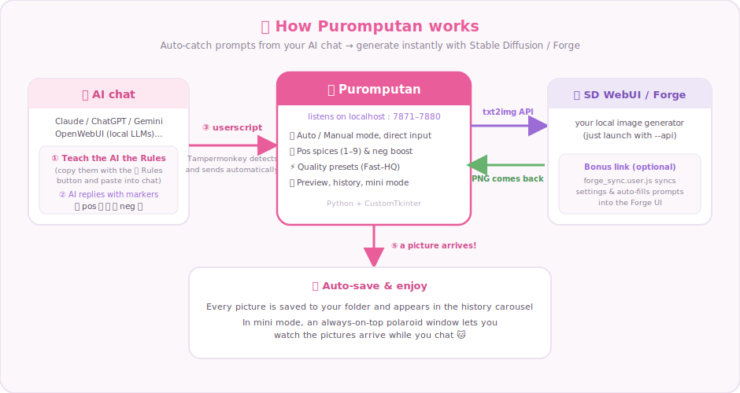
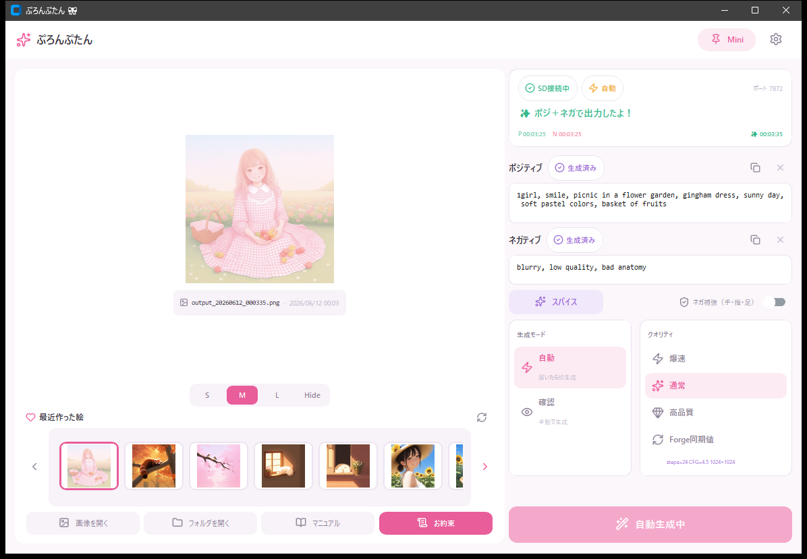
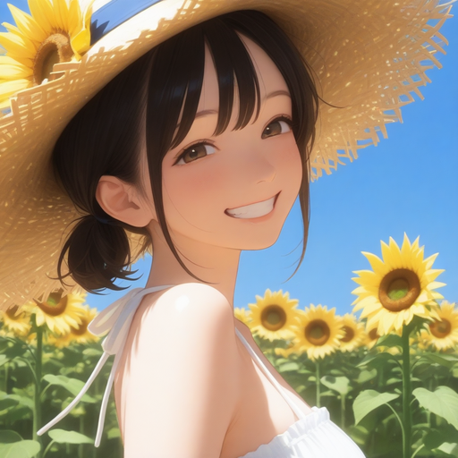
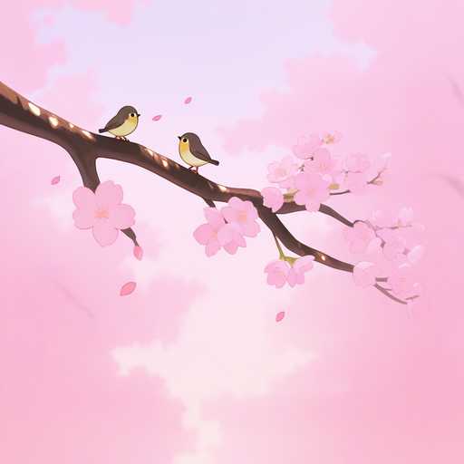
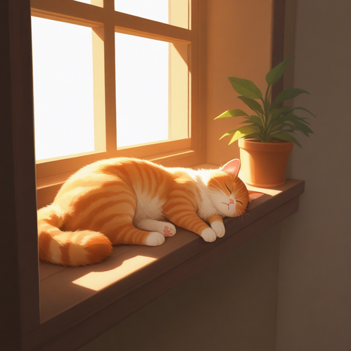
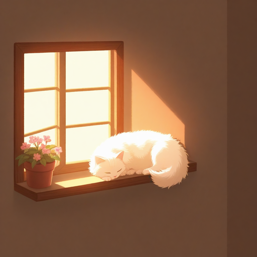
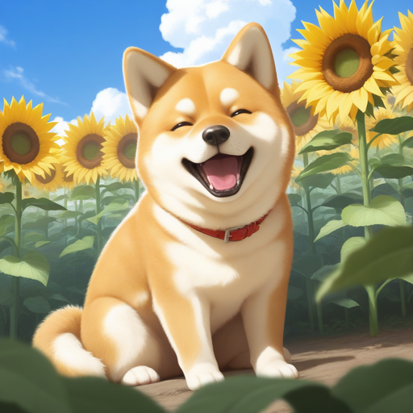
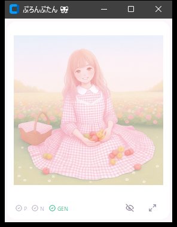

<div align="center">

# 🎀 Puromputan

**Turn your AI chat's scenes into pictures, as you talk.**

A bridge tool that auto-catches image prompts from AI replies and generates them instantly with Stable Diffusion / Forge


[日本語](README_JA.md) ｜ **English**

[📖 Manual (English)](MANUAL_EN.md) ｜ [📖 マニュアル（日本語）](MANUAL_JA.md)

</div>

---

## ✨ What is Puromputan?

When you're chatting with an AI, there's always that moment — *"I want to see this scene as a picture!"*
**Puromputan** auto-catches the image prompts your AI writes with special markers, and sends them straight to your local Stable Diffusion WebUI / Forge.

Just keep chatting, and pictures arrive in the window next to you. That's Puromputan. 🐱

> By the way, the name is *prompt* + **-tan** — a Japanese suffix of endearment. Yes, she's lovingly made in Japan 🎀

<div align="center">

</div>

## 🖥 Screen

Received prompts, the generated picture, and the history carousel — all at a glance.

<div align="center">

</div>

## 🖼 Sample Gallery

All generated through Puromputan (model: NoobAI family).

| | | |
|:---:|:---:|:---:|
|  |  |  |
| Sunflower field & straw hat | Autumn red panda | Little bird on a sakura branch |
|  |  |  |
| Cat dozing by the window | White cat on a windowsill | Shiba & sunflowers |

## 🆕 What's New!

- **2026/06/11**
  - ✍️ **Manual input** — type directly into the fields, or tweak a received prompt before generating
  - 💡 Lamp overhaul: pills now flow `Waiting → Received → Generated`, the busy chip pulses while generating, and mini lamps blink brightly on arrival
  - 🪄 **Forge prompt auto-fill** (forge_sync v1.3): received prompts are filled into the Forge UI automatically
- **2026/06/10**
  - 📌 Mini mode reworked: polaroid-style always-on-top window that remembers its position and size
- **2026/06/09**
  - 🎀 Full UI redesign: Lucide icons, history carousel, elegant-cute color scheme

## 🌟 Features

| Feature | Description |
|---|---|
| 📡 Auto receive | A browser userscript detects 🔴pos🟥 / 🔵neg🟦 markers and sends them automatically |
| ⚡ Auto / Manual mode | Generate the moment a prompt arrives, or review it and press the button yourself |
| ✍️ Manual input | Type into the fields directly — edits to received prompts are used as-is |
| 🌶 Pos spices | Nine one-touch "extra flavor" prompt slots, merged in at generation time |
| 🛡 Neg boost | One switch appends an anti-artifact template (hands, fingers, feet) to the negative |
| 💎 Quality presets | Fast / Normal / High Quality / Forge-synced values |
| 🖼 Preview & history | S/M/L/Hide sizes, history carousel, the newest picture is auto-selected with a pink frame |
| 📌 Mini mode | Polaroid-style, always on top — the "real" way to enjoy pictures while chatting |
| 🙈 Hide | Hides the preview, history and filename all at once (quick privacy) |
| 🪄 Forge link | Sync generation settings & auto-fill prompts into the Forge UI (optional) |
| 🌐 JP / EN | The UI speaks both Japanese and English |

## 💻 Requirements

| Item | Details |
|---|---|
| OS | Windows 10 / 11 |
| Python | 3.11+ |
| Image generation | Stable Diffusion WebUI (AUTOMATIC1111) or Forge, launched with `--api` |
| Browser | Anything that runs Tampermonkey (Chrome / Edge / Firefox …) |
| Supported chats | Claude / ChatGPT / Gemini / Grok / Copilot / OpenWebUI and more* |

\* For local chat UIs like OpenWebUI, add your own URL to the `@match` lines in `sd_monitor.user.js`.

## 🚀 Setup

```bash
# 1. Install dependencies
pip install -r requirements.txt

# 2. Launch SD WebUI / Forge with the API enabled
#    (just add --api to its launch options)

# 3. Start Puromputan!
python app.py        # or the start.bat launcher
```

**Browser side (one-time)**

1. Install [Tampermonkey](https://www.tampermonkey.net/)
2. Register `sd_monitor.user.js` → auto-detects and sends prompts from chat pages
3. (Optional) Register `forge_sync.user.js` → Forge settings sync & prompt auto-fill

**AI side (one-time)**

Teach your AI the contents of `AIへのお約束.txt` (the Rules — copy them with the 📋 Rules button). Once the AI replies like this, you're ready:

```
🔴 1girl, sunflower field, straw hat, smile, blue sky 🟥
🔵 blurry, low quality, bad anatomy 🟦
```

Then just chat. Every marked reply becomes a picture. 🎀

## 💎 Quality Presets

| Preset | Use case |
|---|---|
| ⚡ Fast | When you want lots of pictures quickly (fewer steps) |
| ✨ Normal | Everyday balance |
| 💠 High Quality | For that special one |
| 🔄 Forge Sync | Use exactly the values set in the Forge UI |

## 📌 Mini Mode

Press the **Mini** button (top-right) to transform into a small polaroid-style window.

<div align="center">

</div>

- Always on top, picture first (all extra UI hides away)
- The lamps tell you what's happening: **P / N** (blink brightly on arrival → fade once generated) and **GEN** (pulsing orange = generating → green = done)
- Window position and size are remembered for next time

Park it in the corner of your chat and watch the pictures arrive while you talk.

## 🔧 Troubleshooting

| Symptom | Check |
|---|---|
| Nothing is received | Is Puromputan running? Is the Tampermonkey script enabled? Does the AI's reply contain the markers (🔴🟥)? |
| Nothing generates | Is SD WebUI / Forge running with `--api`? Is the URL in Settings correct? |
| "Same prompt — skipped" appears | That's the duplicate guard. Press the Generate button to remake as many times as you like (the seed is random every time) |
| More details | See the [📖 Manual](MANUAL_EN.md) |

## 🙏 Acknowledgments

- [Lucide](https://lucide.dev/) — icons (ISC License)
- [CustomTkinter](https://customtkinter.tomschimansky.com/) — GUI framework
- [Stable Diffusion WebUI](https://github.com/AUTOMATIC1111/stable-diffusion-webui) / [Forge](https://github.com/lllyasviel/stable-diffusion-webui-forge) — image generation
- [Tampermonkey](https://www.tampermonkey.net/) — browser integration

## 📜 Terms of Use & Disclaimer

- The copyright of this software belongs to the author (All rights reserved).
- Personal use and tinkering on your own machine are welcome. **Please do not redistribute it or publish modified versions without permission** (if you'd like to, just ask!).
- Use at your own risk. The author assumes no responsibility for any damages arising from its use.
- Handle generated images in accordance with the license of the model you use and the terms of each chat service.
- Please refrain from uses that violate public order and morals.

---

<div align="center">

🎀 **Puromputan** — a little atelier beside your chat.

</div>
